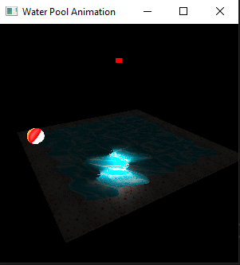

# Water Animation - Simulating Water Motion with OpenGL in C++

## Overview
Welcome to the Water Animation project! This project aims to bring the captivating motion of water to life through the power of computer graphics. Leveraging the principles of fluid dynamics, mathematical equations, and physics, we strive to create realistic and visually compelling water effects in a 3D environment.

## Requirements/Design
The heart of this project lies in the seamless integration of fluid simulation algorithms with the rendering capabilities of OpenGL. Developed primarily in Visual Studio 2019 using C++, our project sets up initial parameters on the CPU and then proceeds to the rendering phase. The rendering process employs two crucial shader files per object: the Vertex Shader and the Fragment Shader. These shaders, written in Visual Studio Code and executed using GLSL (OpenGL Shading Language), play a vital role in achieving lifelike water visuals.

## How to Run
To experience the mesmerizing water animation, follow these simple steps:
1. Open the project in Visual Studio C++.
2. Navigate to and click on the Solution file (`FinalProject3009.sln`).
3. Run the code in x86 (Win32) mode.

## Animation Environment Controls
- **Alter Light Radius/Intensity:** Press any number from 1 to 9.
- **Zoom In:** Press "z".
- **Zoom Out:** Press "Z".
- **Move Light Position:** Utilize the arrow keys.
- **Move/Rotate Objects:** Click and drag the mouse. Click again to stop rotating.
- **Render Wireframe:** Press "t".
- **Rotate Camera Left/Right:** Press "x" or "c".

Feel free to explore and experiment with these controls to interact with the animation environment!
## Render Preview

---

*Feel free to contact me at victortomisin@yahoo.com for any questions!*
